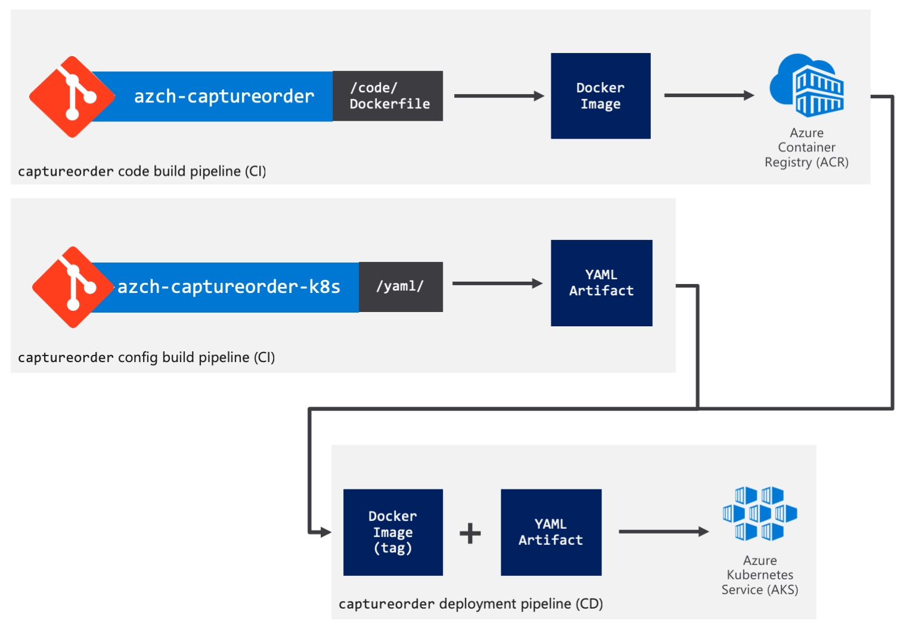

# Lab 8: Continuous Integration and Continuous Delivery
Your development team are making an increasing number of modifications to your application code. It is no longer feasible to manually deploy updates.

You are required to create a robust DevOps pipeline supporting CI/CD to deploy code changes.



## 1. Create an Azure DevOps account
Go to https://dev.azure.com and sign-in with your Azure subscription credentials.
If this is your first time to provision an Azure DevOps account, you’ll be taken through a quick wizard to create a new organization.

## 2. Create a project
Create a new private project, call it azch-captureorder

## 3. Import the source repositories on GitHub to Azure Repos
Click on **Repos** then **Import** the code of the captureorder service from the public GitHub repository located at http://github.com/Azure/azch-captureorder.git

## 4. Create build pipeline for the application Docker container
Save the YAML below as azure-pipelines.yml 
```YAML
pool:
  vmImage: 'Ubuntu 16.04'

variables:
  imageName: 'captureorder:$(Build.BuildId)'
  # define three more variables acrName, dockerId and dockerPassword in the build pipeline in UI

steps:
- script: docker build -f Dockerfile -t $(acrName).azurecr.io/$(imageName) .
  displayName: 'docker build'

- script: docker login -u $(dockerId) -p $(dockerPassword) $(acrName).azurecr.io
  displayName: 'docker login'

- script: docker push $(acrName).azurecr.io/$(imageName)
  displayName: 'docker push'
```

## 5. Build the code in azch-captureorder as a Docker image and push it to the Azure Container Registry you provisioned before
Click on **Set up Build**, Choose **YAML** as the pipeline template. 

Browse to and select the azure-pipelines.yml file you created above. 

You may also change the agent to be **Hosted Ubuntu 1604**.

Define variables in your build pipeline in the web UI:
Click on **Library**, then click on **+ Variable group** to create a new variable group called acr.
Add the following variables:
- acrName: The Azure Container Registry name.
- dockerId: The admin user name/Service Principal ID for the Azure Container Registry.
- dockerPassword: The admin password/Service Principal password for Azure Container Registry.

>Hint: It would be better if you store those variables as a Variable Group instead of a Pipeline Variable. This will allow you to reuse them across pipelines.

Click on **Pipelines**, Choose azch-captureorder-CI pipeline, Click on **Edit**, then Click on **...**, Choose **Pipeline settings**, Choose **Variables**, Choose **Variables groups**, Click on **Link variable group**, Choose the variable group you created before, Click on **Link**.

Run the build pipeline and verify that it works.

Verify that the image ends up in your Azure Container Registry.

## 6. Create a new Azure DevOps Repo to hold the the YAML configuration for Kubernetes
The reason you’re creating a separate repository, is that the Kubernetes deployment configuration is a deployment artifact, which is indepenedent from your code. You may want to change how the container is deployed, which Kubernetes services are created, etc. without triggering a new container build. For this reason, having a seperate repository is the recommended way to go about this, to encourage seperation of concerns. This decouples the application code from where it runs. You build containers in one pipeline but you’re not concerned where they would be deployed. You may have multiple other repos and pipelines controlling how you deploy.

Click on **Repos**, Choose **New repository**.

Go ahead and create a new repo and call it azch-captureorder-kubernetes. Hit the **Initialize** button to create a README.md file and add the .gitignore file.

In the new repository, create a folder yaml and add the required YAML files you created before for the service you’re building.

You may download the YAML files again from the links below. Make sure you store them in the yaml folder on the azch-captureorder-kubernetes repository.

Save the YAML below as captureorder-deployment.yaml, and put into yaml folder.
```YAML
apiVersion: apps/v1
kind: Deployment
metadata:
  name: captureorder
spec:
  selector:
      matchLabels:
        app: captureorder
  replicas: 2
  template:
      metadata:
        labels:
            app: captureorder
      spec:
        containers:
        - name: captureorder
          image: <unique-acr-name>.azurecr.io/captureorder:##BUILD_ID##
          imagePullPolicy: Always
          readinessProbe:
            httpGet:
              port: 8080
              path: /healthz
          livenessProbe:
            httpGet:
              port: 8080
              path: /healthz
          resources:
            requests:
              memory: "64Mi"
              cpu: "100m"
            limits:
              memory: "128Mi"
              cpu: "500m"
          env:
          - name: TEAMNAME
            value: "team-azch"
          - name: MONGOHOST
            value: "orders-mongo-mongodb.default.svc.cluster.local"
          - name: MONGOUSER
            value: "orders-user"
          - name: MONGOPASSWORD
            value: "orders-password"
          ports:
          - containerPort: 80
```
>Hints: One thing you’ll notice is that, in captureorder-deployment.yaml, you’ll need to change the image name <unique-acr-name>.azurecr.io/captureorder:##BUILD_ID##. Put in your Azure Container Registry name.
Also notice the ##BUILD_ID##. This is a placeholder that will get replaced further down the line by the release pipeline by the actual version being deployed.
  
Save the YAML below as captureorder-service.yaml, and put into yaml folder.
```YAML
apiVersion: v1
kind: Service
metadata:
  name: captureorder
spec:
  selector:
    app: captureorder
  ports:
  - protocol: TCP
    port: 80
    targetPort: 8080    
  type: LoadBalancer
```
Save the YAML below as captureorder-hpa.yaml, and put into yaml folder.
```YAML
apiVersion: autoscaling/v1
kind: HorizontalPodAutoscaler
metadata:
  name: captureorder
spec:
  scaleTargetRef:
    apiVersion: apps/v1
    kind: Deployment
    name: captureorder
  minReplicas: 4
  maxReplicas: 10
  targetCPUUtilizationPercentage: 50
```

## 7. Create build pipeline for the Kubernetes config files
Save the YAML below as azure-pipelines.yml, store it in your Kubernetes config repository (azch-captureorder-kubernetes).
```YAML
pool:
  vmImage: 'Ubuntu 16.04'

steps:
- task: PublishBuildArtifacts@1
  displayName: 'publish yaml folder as an artifact'
  inputs:
    artifactName: 'yaml'
    pathToPublish: 'yaml'
```
Similarly to how you setup the Docker images build pipeline, setup a build pipeline using **YAML** pipelines for azch-captureorder-kubernetes repo. Run it once you save and verify you get the yaml folder copied as a build artifact.

## 8. Create a continuous deployment pipeline
You’ll now create the CD pipeline on the azch-captureorder-kubernetes repository that triggers upon either new container images or new YAML configuration artifacts to deploy the changes to your cluster.

Configure a Service Connection so that Azure DevOps can access resources in your Azure Resource Group for deployment and configuration purposes

Choose azch-captureorder project, Click on **Project settings**, Choose **Pipelines** -> **Service connnections**, Choose **+ New service connection**, Choose **Azure Resource Manager**, Pick the Azure Resource Group you’re using.

Create a Release Pipeline, start with an Empty template. Add an Azure Container Registry artifact as a trigger and enable the **Continuous deployment trigger**. Make sure to configure it to point to the Azure Container Registry repository where the build pipeline is pushing the captureorder image.

Add another Build artifact coming from the azch-captureorder-kubernetes pipeline as a trigger and enable the **Continuous deployment trigger**. This is the trigger for changes in the **YAML** configuration.

>Hint: Make sure to pick the kubernetes build pipeline and not your main code build pipeline. Also make sure you select **Latest** as the default version.

Now, start adding tasks to the default stage. Make sure the agent pool is **Hosted Ubuntu 1604** then add an inline **Bash Script** task that will do a token replacement to replace ##BUILD_ID## in the captureorder-deployment.yaml file coming from the with the actual build being released. Remember that captureorder-deployment.yaml was published as a build artifact.

You’ll want to get the Docker container tag incoming from the Azure Container Registry trigger to replace the ##BUILD_ID## token. If you named that artifact *_captureorder*, the build number will be in an environment variable called *RELEASE_ARTIFACTS__CAPTUREORDER_BUILDNUMBER*. Similarly for the other artifact *_azch-captureorder-kubernetes*, its build ID would be stored in *RELEASE_ARTIFACTS__AZCH-CAPTUREORDER-KUBERNETES-CI_BUILDID*. You can use the following inline script that uses the sed tool.
```shell
sed -i "s/##BUILD_ID##/${RELEASE_ARTIFACTS__CAPTUREORDER_BUILDNUMBER}/g" "$SYSTEM_ARTIFACTSDIRECTORY/_azch-captureorder-kubernetes-CI/yaml/captureorder-deployment.yaml"
```

Add a **Deploy to Kubernetes** task. Configure access to your AKS cluster using the service connection created earlier. Choose **apply** in the command choices.

Scroll down and check Use configuration files and use the following value *$(System.DefaultWorkingDirectory)/_azch-captureorder-kubernetes-CI/yaml/captureorder-deployment.yaml* or select it from the browse button.

Do the same for captureorder-service.yaml and captureorder-hpa.yaml. You can right click on the Kubernetes task and clone it.

Create a manual release and pick the latest build as the source. Verify the release runs and that the captureorder service is deployed.

## 9. Verify everything works
Make a change to the application source code, commit the change and watch the pipelines build and release the new version.

Make a change to the configuration (for example, change the number of replicas), commit the change and watch the pipelines update your configuration.
